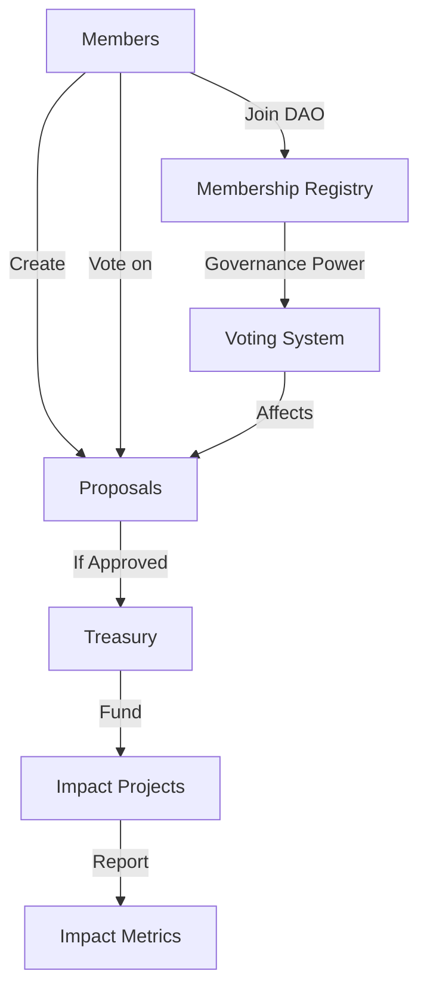

# Impact Governance DAO

A decentralized autonomous organization (DAO) framework for collective decision-making around social impact initiatives. This platform enables community members to propose, vote on, and fund projects that create positive social change through a transparent and democratic process.

## Overview

Impact Governance DAO provides a comprehensive solution for managing community-driven social impact projects. The platform features:

- Membership management through governance tokens
- Proposal creation and voting system
- Treasury management for fund allocation
- Impact tracking and reporting
- Reputation-based participation

## Architecture

The DAO is built on a single smart contract that manages all core functionality. Here's how the components interact:



### Core Components
- **Membership System**: Tracks member tokens, reputation, and participation
- **Proposal System**: Manages project proposals and voting
- **Treasury**: Handles fund management and distribution
- **Governance**: Enables parameter updates and admin controls

## Contract Documentation

### Impact DAO Contract
The main contract (`impact-dao.clar`) implements all core functionality:

#### Key Features
- Membership management
- Proposal creation and voting
- Treasury operations
- Governance parameter management

#### Access Control
- **Members**: Can create proposals and vote
- **Admin**: Can update DAO parameters
- **Anyone**: Can view DAO information

## Getting Started

### Prerequisites
- Clarinet installation
- Stacks wallet for deployment

### Basic Usage

1. **Join the DAO**
```clarity
(contract-call? .impact-dao join-dao u100)
```

2. **Create a Proposal**
```clarity
(contract-call? .impact-dao create-proposal 
    "Project Title"
    "Description"
    none
    u1000
    tx-sender
    "Impact Metrics"
)
```

3. **Vote on Proposals**
```clarity
(contract-call? .impact-dao vote u1 true)
```

## Function Reference

### Public Functions

#### Membership
- `(join-dao (token-amount uint))`: Join the DAO with specified tokens
- `(get-member (member-addr principal))`: Get member details

#### Proposals
- `(create-proposal ...)`: Submit new proposal
- `(vote (proposal-id uint) (vote-for bool))`: Vote on proposal
- `(finalize-proposal (proposal-id uint))`: End voting period
- `(execute-proposal (proposal-id uint))`: Execute approved proposal

#### Treasury
- `(deposit-to-treasury (amount uint))`: Add funds to treasury

#### Governance
- `(update-dao-parameters ...)`: Modify DAO settings
- `(transfer-admin (new-admin principal))`: Transfer admin rights

### Read-Only Functions
- `(get-dao-info)`: Get DAO configuration
- `(get-proposal (proposal-id uint))`: Get proposal details
- `(check-proposal-status (proposal-id uint))`: Check proposal state

## Development

### Testing
1. Clone the repository
2. Install dependencies: `clarinet install`
3. Run tests: `clarinet test`

### Local Development
1. Start Clarinet console: `clarinet console`
2. Deploy contracts: `clarinet deploy`

## Security Considerations

### Limitations
- Voting power tied directly to token holdings
- No delegation functionality
- Simple treasury management

### Best Practices
- Always check proposal status before execution
- Verify treasury has sufficient funds
- Monitor voting periods
- Review impact metrics before approval

### Risks
- Potential for vote manipulation with large token holdings
- Treasury fund security depends on admin controls
- Impact measurement relies on honest reporting